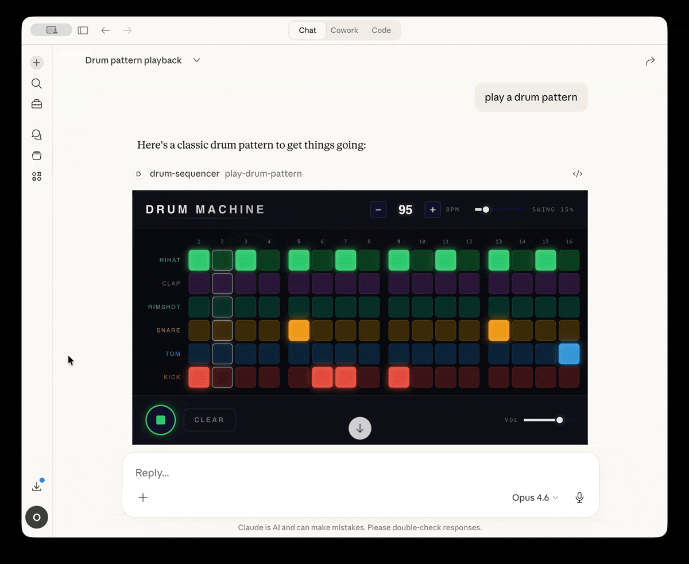

# Drum Machine MCP App

An interactive drum machine and step sequencer that runs as an [MCP App](https://github.com/modelcontextprotocol/ext-apps) inside Claude Desktop and other MCP-enabled hosts.

7 synthesized instruments (kick, snare, hi-hat, open hi-hat, clap, tom, rimshot) on a 16-step grid with genre presets, solo/mute, velocity accents, and a live oscilloscope. All audio is generated via [Tone.js](https://tonejs.github.io/) synthesis — no samples needed.



## Try It

Add as a remote MCP connector in Claude Desktop:

```
https://web-production-89abb.up.railway.app/mcp
```

Go to **Settings > MCP Servers > Add custom connector**, paste the URL, then ask Claude to "play a drum pattern".

## Local Development

```bash
npm install
npm run dev
```

This starts the MCP server on `http://localhost:3001/mcp` with hot-reloading.

## Testing with basic-host

```bash
npm run build

# In another terminal, clone and run the basic-host:
git clone --depth 1 https://github.com/modelcontextprotocol/ext-apps.git /tmp/mcp-ext-apps
cd /tmp/mcp-ext-apps/examples/basic-host
npm install
SERVERS='["http://localhost:3001/mcp"]' npm run start

# Open http://localhost:8080
```

Select "Drum Sequencer MCP App Server" from the server dropdown, choose `play-drum-pattern`, and hit "Call Tool".

## Claude Desktop

Add to your Claude Desktop config (`~/Library/Application Support/Claude/claude_desktop_config.json`):

```json
{
  "mcpServers": {
    "drum-sequencer": {
      "command": "npx",
      "args": ["tsx", "/path/to/drum-machine-mcp-app/main.ts", "--stdio"]
    }
  }
}
```

Restart Claude Desktop and ask it to "play a drum pattern".

## Architecture

This is an MCP App — an extension to the Model Context Protocol that pairs tools with interactive UI resources.

- **`server.ts`** — Registers the `play-drum-pattern` tool and the HTML UI resource
- **`main.ts`** — Entry point with Streamable HTTP and stdio transports
- **`src/mcp-app.ts`** — UI logic: sequencer grid, Tone.js audio engine, App SDK integration
- **`src/styles.css`** — Dark neon glow aesthetic
- **`mcp-app.html`** — HTML shell with Tone.js CDN
- **`vite.config.ts`** — Bundles UI into a single HTML file via vite-plugin-singlefile

## Tool: `play-drum-pattern`

| Parameter | Type | Default | Description |
|-----------|------|---------|-------------|
| `bpm` | number | 120 | Tempo (40-200) |
| `pattern` | object | boom-bap beat | 7 instruments x 16 boolean steps |
| `swing` | number | 0 | Shuffle amount (0-1) |

Supports streaming input via `ontoolinputpartial` — the grid updates live as the LLM generates tool arguments.

## Tech Stack

- **Audio**: Tone.js (CDN) — MembraneSynth, NoiseSynth
- **UI**: Vanilla JS + CSS
- **Build**: Vite + vite-plugin-singlefile
- **MCP**: @modelcontextprotocol/sdk + @modelcontextprotocol/ext-apps
